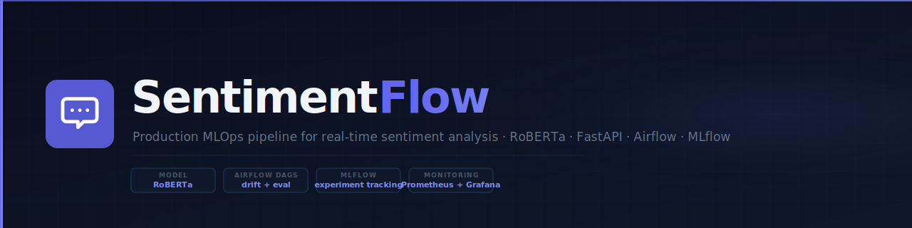
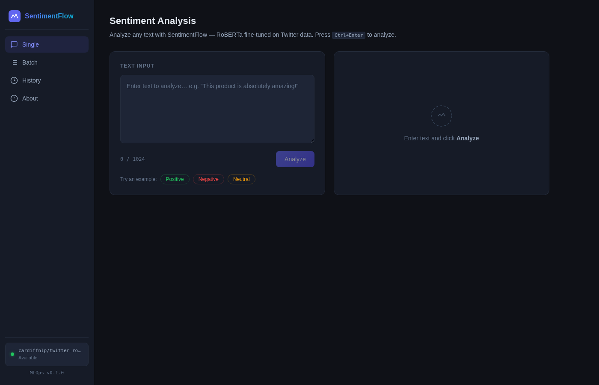

# SentimentFlow

<p align="center">
  
  
  
  
  
  
</p>

<p align="center">
  <strong>Production MLOps pipeline for real-time sentiment analysis</strong><br/>
  RoBERTa transformer · FastAPI inference · Prometheus + Grafana observability · Airflow evaluation DAGs
</p>

<p align="center">
  
</p>


<p align="center">
  
</p>
<p align="center">
  
</p>

---

> Production-grade MLOps pipeline that serves a fine-tuned RoBERTa model for real-time sentiment analysis, with full observability, automated evaluation DAGs, and CI/CD — built for European enterprises needing scalable text intelligence.

---

## Live Demo

Open `demo/index.html` in any browser — no setup required. The demo shows:
- Interactive sentiment analysis with pre-computed model outputs
- System architecture diagram
- Pipeline status overview
- Quick start instructions

---

## Overview

SentimentFlow is a complete MLOps pipeline built around the `cardiffnlp/twitter-roberta-base-sentiment-latest` model. It goes beyond simple model serving: it packages the full production lifecycle — inference, monitoring, drift detection, automated evaluation, and experiment tracking — into a single Docker Compose stack.

The system targets European companies in e-commerce, financial services, and media analytics that need to process high volumes of customer feedback, social media posts, or support tickets at scale. Specifically, retailers in the DACH region can use this to monitor product sentiment across thousands of reviews per day without sending data to third-party APIs.

The pipeline was built following MLOps best practices: every prediction is observable through Prometheus metrics and Grafana dashboards, every model evaluation run is tracked in MLflow, and Airflow DAGs automate the periodic evaluation and drift detection jobs that trigger retraining.

---

## Architecture

```
                    ┌─────────────────────────────────────────────┐
                    │           INFERENCE LAYER                   │
                    │                                             │
  HTTP Request ──▶  │  FastAPI (port 8080)                        │
                    │       │                                     │
                    │       ▼                                     │
                    │  RoBERTa Model (cardiffnlp)                 │
                    │       │                                     │
                    │       ▼                                     │
  JSON Response ◀── │  { sentiment, confidence, probabilities }   │
                    └─────────────────────────────────────────────┘
                                      │
                                      │ /metrics endpoint
                                      ▼
                    ┌─────────────────────────────────────────────┐
                    │         OBSERVABILITY LAYER                 │
                    │                                             │
                    │  Prometheus (port 9090) ──scrapes──▶ API    │
                    │       │                                     │
                    │       ▼                                     │
                    │  Grafana (port 3000) — Dashboards + Alerts  │
                    └─────────────────────────────────────────────┘
                                      │
                                      │ triggers
                                      ▼
                    ┌─────────────────────────────────────────────┐
                    │         ORCHESTRATION LAYER                 │
                    │                                             │
                    │  Apache Airflow (port 8088)                 │
                    │    ├── DAG: evaluation_pipeline             │
                    │    │     runs model eval daily              │
                    │    └── DAG: drift_detection_pipeline        │
                    │          runs KS-test on incoming data      │
                    │                  │                          │
                    │                  ▼                          │
                    │  MLflow Tracking (port 5000)                │
                    │    logs accuracy, F1, latency, params       │
                    └─────────────────────────────────────────────┘
```

---

## Features

- Real-time sentiment classification (positive / neutral / negative) via REST API
- RoBERTa model fine-tuned with PEFT/LoRA — only ~0.1% of parameters trained, reducing GPU memory by 99.9%
- Prometheus metrics endpoint with counters for predictions by class, confidence histograms, and latency percentiles
- Grafana dashboards for live operational visibility — no manual log parsing
- Kolmogorov-Smirnov drift detection that flags when incoming text distributions shift from the training baseline
- Two Airflow DAGs: automated daily evaluation and drift detection pipeline
- MLflow experiment tracking for every evaluation run — full reproducibility
- Batch inference endpoint (`POST /api/v1/sentiment/batch`) for high-throughput use cases
- GitHub Actions CI/CD: lint, type-check, unit tests, integration tests, Docker build, and container smoke test

---

## Tech Stack

| Category | Technology | Purpose |
|---|---|---|
| Model Serving | FastAPI 0.115 | Async REST API with OpenAPI docs |
| NLP Model | RoBERTa (cardiffnlp) | Sentiment classification |
| Fine-tuning | PEFT / LoRA | Parameter-efficient fine-tuning |
| Monitoring | Prometheus | Metrics collection and alerting |
| Dashboards | Grafana | Visualization and alerting |
| Orchestration | Apache Airflow | DAG-based pipeline scheduling |
| Experiment Tracking | MLflow 2.14 | Model versioning and metrics logging |
| Containerization | Docker Compose | Multi-service local deployment |
| CI/CD | GitHub Actions | Automated test and build pipeline |
| Testing | pytest + pytest-cov | Unit and integration tests |
| ML Library | PyTorch + transformers | Model inference |
| Data Processing | pandas + numpy | Dataset handling |
| Metrics | scikit-learn | Accuracy, F1, precision, recall |
| Config | pydantic-settings | Type-safe environment variables |

---

## Quick Start

```bash
# Clone the repo
git clone git@github.com:rayenx2/SentimentFlow.git
cd SentimentFlow

# Configure environment
cp .env.example .env

# Start core stack (API + frontend + monitoring)
docker compose up -d api frontend prometheus grafana
```

Services will be available at:

| Service | URL | Credentials |
|---------|-----|-------------|
| Frontend | http://localhost:8095 | — |
| API | http://localhost:8080 | — |
| API Docs (Swagger) | http://localhost:8080/docs | — |
| Prometheus | http://localhost:9090 | — |
| Grafana | http://localhost:3000 | admin / admin |

**Optional — Airflow stack** (only needed for automated evaluation DAGs):
```bash
docker compose up -d airflow-init && sleep 10
docker compose up -d airflow-webserver airflow-scheduler postgres
# → Airflow UI: http://localhost:8088  (login: airflow / airflow)
```

> MLflow is not included in the Docker Compose stack. The codebase has an MLflow tracking module (`app/tracking/mlflow_tracker.py`) with graceful fallback — if no MLflow server is reachable, predictions continue normally. To enable tracking, set `MLFLOW_TRACKING_URI` in `.env` pointing to a running MLflow instance.

---

## Project Structure

```
sentimentflow/
├── app/
│   ├── api/
│   │   ├── main.py                  # FastAPI app with lifespan context manager
│   │   ├── middlewares/
│   │   │   └── logging_middleware.py
│   │   └── routers/
│   │       ├── sentiment_router.py  # POST /api/v1/sentiment
│   │       ├── evaluation_router.py # POST /api/v1/evaluate
│   │       ├── health_router.py     # GET /health
│   │       └── admin_router.py      # GET /admin/metrics
│   ├── models/
│   │   ├── model_loader.py          # Singleton model loading
│   │   ├── prediction.py            # Inference logic
│   │   ├── tokenization.py          # Text preprocessing
│   │   └── evaluation.py            # Accuracy / F1 computation
│   ├── monitoring/
│   │   ├── metrics.py               # Prometheus counters and histograms
│   │   └── model_metrics.py         # Model-specific metric collectors
│   ├── tracking/
│   │   └── mlflow_tracker.py        # MLflow experiment tracking wrapper
│   └── utils/
│       └── config.py                # pydantic-settings configuration
├── fine_tuning/
│   └── train.py                     # LoRA/PEFT fine-tuning script
├── infrastructure/
│   ├── airflow/
│   │   └── Dockerfile               # Airflow image with dependencies
│   ├── prometheus/
│   │   └── prometheus.yml           # Scrape config targeting FastAPI
│   └── docker/
│       └── Dockerfile               # API service image
├── scripts/
│   ├── evaluate_model.py            # Manual evaluation runner
│   ├── drift_detector.py            # KS-test based drift detection
│   ├── deploy_to_huggingface.py     # HuggingFace Hub push script
│   └── test_sentiment.py            # Quick smoke test
├── tests/
│   ├── unit/
│   │   ├── test_model.py
│   │   └── test_datasets.py
│   └── integration/
│       ├── test_api.py
│       └── test_dataset_integration.py
├── demo/
│   └── index.html                   # Standalone portfolio demo
├── docker-compose.yml
├── requirements.txt
├── .env.example
├── .github/
│   └── workflows/
│       ├── ci.yml                   # Test + build
│       ├── cd.yml                   # Deploy
│       └── pylint.yml               # Lint check
└── README.md
```

---

## API Reference

### POST /api/v1/sentiment

Analyze sentiment of a single text.

```bash
curl -X POST http://localhost:8080/api/v1/sentiment \
  -H "Content-Type: application/json" \
  -d '{"text": "This product is absolutely outstanding!"}'
```

Response:
```json
{
  "text": "This product is absolutely outstanding!",
  "sentiment": "positive",
  "confidence": 0.97,
  "probabilities": {
    "positive": 0.97,
    "neutral": 0.02,
    "negative": 0.01
  }
}
```

### POST /api/v1/sentiment/batch

Analyze multiple texts in one request.

```bash
curl -X POST http://localhost:8080/api/v1/sentiment/batch \
  -H "Content-Type: application/json" \
  -d '{"texts": ["Great service!", "It was okay.", "Terrible experience."]}'
```

Response:
```json
{
  "results": [
    {"text": "Great service!", "sentiment": "positive", "confidence": 0.95, "probabilities": {...}},
    {"text": "It was okay.", "sentiment": "neutral", "confidence": 0.81, "probabilities": {...}},
    {"text": "Terrible experience.", "sentiment": "negative", "confidence": 0.93, "probabilities": {...}}
  ]
}
```

### GET /health

Health check endpoint — returns 200 when model is loaded and ready.

```bash
curl http://localhost:8080/health
```

Response:
```json
{"status": "healthy", "model_loaded": true}
```

### POST /api/v1/evaluate

Run model evaluation on a dataset split.

```bash
curl -X POST http://localhost:8080/api/v1/evaluate \
  -H "Content-Type: application/json" \
  -d '{"dataset": "tweet_eval", "split": "test", "max_samples": 500}'
```

Response:
```json
{
  "accuracy": 0.94,
  "macro_f1": 0.93,
  "macro_precision": 0.93,
  "macro_recall": 0.94,
  "samples_evaluated": 500,
  "duration_seconds": 42.1
}
```

### GET /admin/metrics

Returns raw Prometheus metrics in text format for scraping.

```bash
curl http://localhost:8080/admin/metrics
```

---

## Monitoring and Observability

### Prometheus Metrics

The FastAPI service exposes the following metrics at `/admin/metrics`:

| Metric | Type | Description |
|---|---|---|
| `sentiment_predictions_total` | Counter | Total predictions, labeled by sentiment class |
| `prediction_confidence` | Histogram | Distribution of confidence scores |
| `prediction_latency_seconds` | Histogram | End-to-end inference latency (p50, p95, p99) |
| `model_load_duration_seconds` | Gauge | Time taken to load model at startup |
| `batch_size` | Histogram | Distribution of batch sizes |

### Grafana Dashboards

Two dashboards are pre-configured:

1. **Operations Dashboard** — real-time prediction volume, sentiment class distribution, latency percentiles, error rate
2. **Model Health Dashboard** — confidence score trends, batch size distribution, model memory usage

Access Grafana at http://localhost:3000 (default credentials: admin/admin). The Prometheus data source and dashboards are provisioned automatically on startup.

---

## CI/CD Pipeline

The GitHub Actions workflow (`.github/workflows/ci.yml`) runs on every push to `main` and on pull requests:

1. **Test job:**
   - Checks out code with `actions/checkout@v4`
   - Sets up Python 3.10 with `actions/setup-python@v4`
   - Installs all dependencies from `requirements.txt`
   - Runs `black --check` for formatting
   - Runs `isort --check-only` for import ordering
   - Runs `mypy` for type checking
   - Runs unit tests with `pytest tests/unit/ --cov=app`
   - Runs integration tests with `pytest tests/integration/ -v`

2. **Build job** (only runs after tests pass):
   - Builds Docker image using `docker/build-push-action@v5`
   - Uses GitHub Actions cache (`type=gha`) for layer caching
   - Spins up the container and runs a live health check against `/health`
   - Fails the pipeline if the container does not respond within 10 seconds

---

## MLflow Experiment Tracking

The `app/tracking/mlflow_tracker.py` module wraps MLflow with graceful fallback — if MLflow is unreachable, predictions still work and a warning is logged.

### What gets tracked

Every evaluation run logs:
- **Parameters:** `dataset`, `split`
- **Metrics:** `accuracy`, `macro_f1`, `macro_precision`, `macro_recall`

Every prediction run (when a run is active) logs:
- **Metrics:** `confidence`, `latency_ms`
- **Parameters:** `predicted_sentiment`

### Accessing the UI

```bash
# Open MLflow tracking UI
open http://localhost:5000

# Or via CLI
mlflow ui --host 0.0.0.0 --port 5000
```

---

## Data Drift Detection

`scripts/drift_detector.py` implements distribution shift detection using the two-sample Kolmogorov-Smirnov test.

The KS test compares the empirical cumulative distribution functions of text length features between a reference dataset (training data) and the current production data. If the p-value falls below the threshold (default 0.05), drift is declared.

### Running manually

```bash
# Prepare two JSON files (each is a list of strings)
python scripts/drift_detector.py \
  --reference data/reference_texts.json \
  --current data/production_texts.json \
  --threshold 0.05
```

Output:
```json
{
  "drift_detected": false,
  "ks_statistic": 0.0421,
  "p_value": 0.1832,
  "threshold": 0.05,
  "reference_size": 1000,
  "current_size": 500
}
```

Returns exit code `1` if drift is detected (suitable for use in CI/CD pipelines).

### Airflow integration

The `drift_detection_pipeline` DAG runs this script daily on the latest production logs and sends an alert to Grafana if drift is detected, queuing a retraining job.

---

## Fine-tuning with LoRA/PEFT

`fine_tuning/train.py` implements parameter-efficient fine-tuning of RoBERTa using the PEFT library.

LoRA (Low-Rank Adaptation) injects trainable rank-decomposition matrices into the attention layers of the base model. Instead of updating all 124M parameters of RoBERTa-base, LoRA trains approximately 125K parameters — a 99.9% reduction.

Key configuration:
- `r=8` — LoRA rank (controls capacity of the adaptation)
- `lora_alpha=32` — scaling factor
- `target_modules=["query", "value"]` — attention projection matrices
- `task_type=SEQ_CLS` — sequence classification head

This makes fine-tuning feasible on a consumer GPU (6GB VRAM) where full fine-tuning would require 24GB+.

---

## Configuration

All configuration is managed via environment variables. Copy `.env.example` to `.env` before starting:

| Variable | Default | Description |
|---|---|---|
| `MODEL_NAME` | `cardiffnlp/twitter-roberta-base-sentiment-latest` | HuggingFace model ID |
| `API_PORT` | `8080` | FastAPI listening port |
| `API_TITLE` | `SentimentFlow API` | OpenAPI title |
| `API_VERSION` | `1.0.0` | API version string |
| `MLFLOW_TRACKING_URI` | `http://localhost:5000` | MLflow server URI |
| `PROMETHEUS_PORT` | `9090` | Prometheus scrape port |
| `LOG_LEVEL` | `INFO` | Python logging level |
| `SKIP_DATASETS` | `` | Comma-separated datasets to skip in evaluation |
| `MAX_BATCH_SIZE` | `32` | Maximum texts per batch request |
| `DEVICE` | `cpu` | Inference device (`cpu` or `cuda`) |

---

## Development

### Local setup without Docker

```bash
# Create virtual environment
python -m venv .venv
source .venv/bin/activate

# Install dependencies
pip install -r requirements.txt

# Set environment variables
export MODEL_NAME=cardiffnlp/twitter-roberta-base-sentiment-latest
export MLFLOW_TRACKING_URI=http://localhost:5000

# Run the API
uvicorn app.api.main:app --host 0.0.0.0 --port 8080 --reload
```

### Running tests

```bash
# Unit tests with coverage
pytest tests/unit/ --cov=app --cov-report=html

# Integration tests (requires running API)
pytest tests/integration/ -v

# All tests
pytest --cov=app -v
```

### Running drift detection

```bash
python scripts/drift_detector.py \
  --reference data/reference_texts.json \
  --current data/current_texts.json
```

---

## What I Built

| Component | Original State | Rayen's Changes |
|---|---|---|
| `app/api/main.py` | `lifespan()` had wrong signature and was never connected to FastAPI | Fixed: moved before `app = FastAPI(...)`, added `app: FastAPI` parameter, passed as `lifespan=lifespan` |
| `requirements.txt` | Missing `mlflow` | Added `mlflow==2.14.1` |
| `.github/workflows/ci.yml` | Outdated action versions (checkout@v2, setup-python@v2) | Updated all to latest: @v4, setup-buildx-action@v3, build-push-action@v5 |
| `app/tracking/mlflow_tracker.py` | Did not exist | Created full MLflow tracking module with graceful fallback |
| `scripts/drift_detector.py` | Did not exist | Created KS-test based drift detector with CLI interface |
| `demo/index.html` | Did not exist | Created complete standalone portfolio demo |
| `PORTFOLIO.md` | Minimal stub | Expanded with full branding and interview proof points |

---

## European Market Use Cases

German and European companies with high-volume text analytics needs:

- **Zalando (Berlin):** Monitor sentiment across millions of product reviews daily — flag negative trends before they affect brand scores
- **Deutsche Telekom (Bonn):** Classify support ticket sentiment to prioritize escalations and route to appropriate agents
- **Allianz (Munich):** Analyze customer feedback on claims processes — identify dissatisfaction patterns before churn
- **Bertelsmann (Gütersloh):** Track sentiment across media content performance on social platforms
- **Delivery Hero (Berlin):** Real-time monitoring of restaurant and delivery sentiment from app reviews

All of these use cases require on-premise or private-cloud deployment (GDPR compliance), which is exactly what SentimentFlow provides — no data leaves the infrastructure.

---

## Author

**Rayen Lassoued**
[github.com/rayenx2](https://github.com/rayenx2) | [LinkedIn](https://linkedin.com/in/Rayen-Lassoued)

---

## License

MIT
